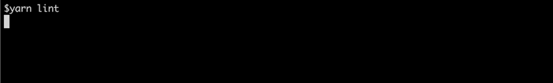

# eslint-plugin-file-progress

[](https://www.npmjs.com/package/eslint-plugin-file-progress)
[](https://github.com/sibiraj-s/eslint-plugin-file-progress/blob/master/LICENSE)
[](https://github.com/sibiraj-s/eslint-plugin-file-progress/actions)

> Eslint plugin to print file progress

## Getting Started

### Installation

```bash
npm i -D eslint-plugin-file-progress
# or
yarn add --dev eslint-plugin-file-progress
```

### Usage

```yml
# .eslintrc.yml

plugins:
  - file-progress

rules:
  file-progress/activate: 1
```

### Demo

Who likes a silent console ¯\\\_(ツ)\_/¯


